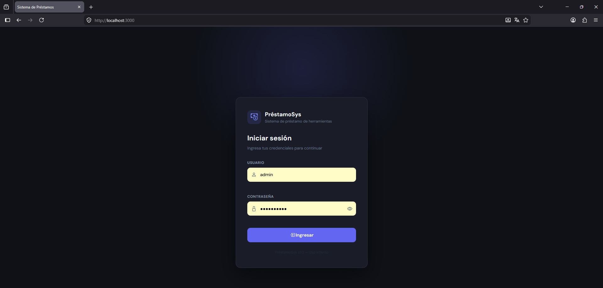
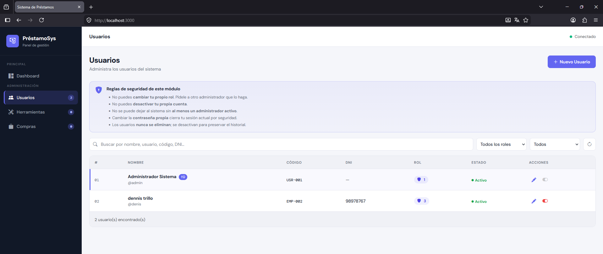
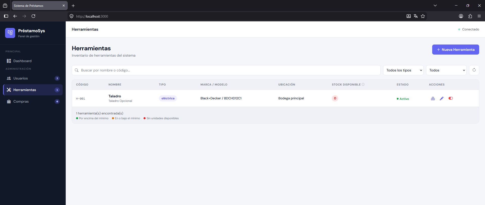
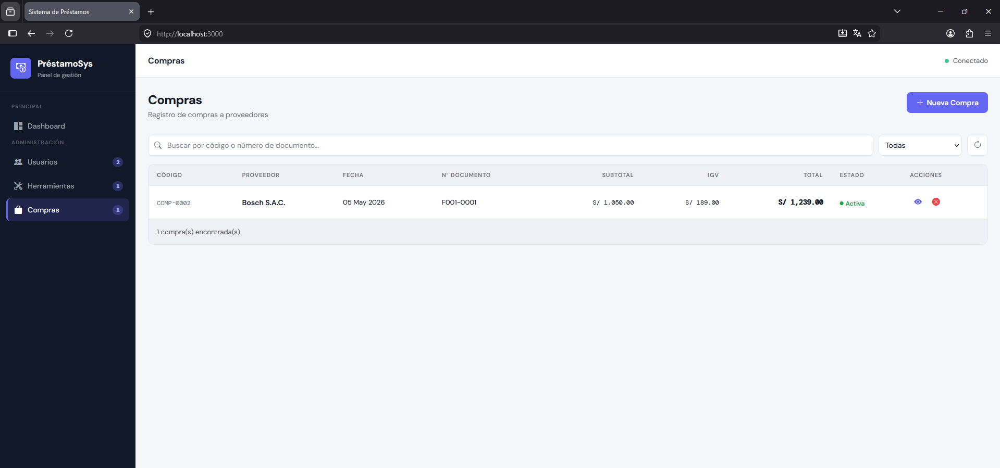

# Sistema de Préstamo de Herramientas

Sistema web interno para la gestión de inventario, préstamo y devolución de herramientas, con control de acceso basado en roles.

---

## Capturas de pantalla

| Login | Gestión de Usuarios |
|-------|---------------------|
|  |  |

| Gestión de Herramientas | Compras |
|------------------------|---------|
|  |  |

---

## Características

- **Autenticación** segura con JWT (expiración configurable)
- **Control de acceso por roles** (RBAC): administrador, encargado de almacén y trabajador
- **Gestión de usuarios**: crear, editar, activar/desactivar, con validación de unicidad (username, DNI, email)
- **Inventario de herramientas**: catálogo maestro con unidades físicas, marcas, modelos, tipos y ubicaciones
- **Registro de compras**: cabecera + detalle por ítem, con opción de anulación
- **Catálogos configurables**: áreas, cargos, turnos, proveedores, estados, marcas, modelos y más
- **Bootstrap automático**: al primer inicio crea los roles, permisos y un usuario administrador base

---

## Tecnologías

| Capa | Tecnología |
|------|------------|
| Runtime | Node.js v24 |
| Framework backend | Express 5 |
| Base de datos | MySQL 8 |
| Autenticación | JSON Web Tokens (JWT) |
| Cifrado | bcrypt |
| Frontend | HTML5 + CSS3 + JavaScript (SPA) |
| Dev tooling | nodemon, dotenv |

---

## Requisitos previos

- Node.js v24
- MySQL 8.0 o superior
- npm

---

## Instalación y puesta en marcha

### 1. Clonar el repositorio

```bash
git clone https://github.com/DenilsonDonr/sistema-prestamos.git
cd sistema-prestamos
```

### 2. Instalar dependencias

```bash
npm install
```

### 3. Crear la base de datos

Ejecutar el script SQL incluido en la raíz del proyecto:

```bash
mysql -u root -p < sql.sql
```

### 4. Configurar variables de entorno

Copiar el archivo de ejemplo y completar los valores:

```bash
cp .env.example .env
```

```env
PORT=3000
NODE_ENV=development

DB_HOST=localhost
DB_PORT=3306
DB_USER=root
DB_PASSWORD=tu_password
DB_NAME=sistema_prestamos

JWT_SECRET=cambia_esto_por_un_secreto_seguro
JWT_EXPIRES_IN=8h

# Credenciales del administrador inicial (opcional — se usan los valores por defecto si no se definen)
ADMIN_USERNAME=admin
ADMIN_PASSWORD=Admin1234!
ADMIN_NOMBRES=Administrador
ADMIN_APELLIDOS=Sistema
ADMIN_CODIGO=USR-001
```

### 5. Iniciar el servidor

```bash
npm run dev
```

En el **primer inicio**, el servidor ejecuta automáticamente:
1. Seeds de roles, permisos, catálogos y proveedores
2. Creación del usuario administrador inicial

A partir del segundo inicio, omite ese proceso y levanta directamente.

---

## Estructura del proyecto

```
sistema-prestamos/
├── public/                  # Frontend (SPA)
│   ├── index.html           # Shell principal
│   ├── login.html           # Página de login
│   ├── css/
│   │   └── styles.css
│   ├── js/
│   │   ├── app.js           # Punto de entrada del cliente
│   │   ├── router.js        # Router del lado cliente
│   │   ├── utils.js         # Utilidades: token, fetch autenticado
│   │   └── modules/         # Lógica por módulo
│   │       ├── login.js
│   │       ├── usuarios.js
│   │       ├── herramientas.js
│   │       └── compras.js
│   └── views/               # Vistas HTML por módulo
│       ├── usuarios.html
│       ├── herramientas.html
│       └── compras.html
├── scripts/
│   ├── bootstrap.js         # Orquestador del setup inicial
│   ├── seed-rbac.js         # Roles y permisos
│   ├── seed-estados.js      # Estados, motivos de baja, tipos de alerta
│   ├── seed-proveedores.js  # Proveedores iniciales
│   └── seed-catalogos-herramientas.js
├── src/
│   ├── app.js               # Configuración de Express y rutas
│   ├── config/
│   │   ├── db.js            # Pool de conexiones MySQL
│   │   └── env.js           # Validación y exportación de variables de entorno
│   ├── controllers/         # Lógica de los endpoints
│   ├── middleware/
│   │   ├── auth.js          # Verificación de JWT
│   │   ├── rbac.js          # Control de acceso por permiso
│   │   └── errorHandler.js  # Manejo centralizado de errores
│   ├── routes/              # Definición de rutas por módulo
│   ├── services/            # Lógica de negocio y acceso a datos
│   ├── utils/               # JWT helper y otros
│   └── validators/          # Validación de datos de entrada
├── docs/
│   └── screenshots/         # Capturas de pantalla del sistema
├── server.js                # Punto de entrada del servidor
├── sql.sql                  # Schema completo de la base de datos
└── package.json
```

---

## API — Endpoints principales

### Autenticación

| Método | Ruta | Descripción | Auth |
|--------|------|-------------|------|
| `POST` | `/api/auth/login` | Iniciar sesión, retorna JWT | No |
| `GET` | `/api/auth/me` | Datos del usuario autenticado | Sí |

### Usuarios

| Método | Ruta | Descripción | Permiso |
|--------|------|-------------|---------|
| `GET` | `/api/usuarios` | Listar todos los usuarios | `usuario.ver` |
| `GET` | `/api/usuarios/:id` | Obtener usuario por ID | `usuario.ver` |
| `POST` | `/api/usuarios` | Crear usuario | `usuario.crear` |
| `PUT` | `/api/usuarios/:id` | Editar usuario | `usuario.editar` |
| `DELETE` | `/api/usuarios/:id` | Desactivar usuario | `usuario.eliminar` |
| `PATCH` | `/api/usuarios/:id/activate` | Reactivar usuario | `usuario.editar` |

### Herramientas

| Método | Ruta | Descripción | Permiso |
|--------|------|-------------|---------|
| `GET` | `/api/herramientas` | Listar herramientas | `herramienta.ver` |
| `GET` | `/api/herramientas/:id` | Obtener herramienta | `herramienta.ver` |
| `POST` | `/api/herramientas` | Crear herramienta | `herramienta.crear` |
| `PUT` | `/api/herramientas/:id` | Editar herramienta | `herramienta.editar` |
| `DELETE` | `/api/herramientas/:id` | Eliminar herramienta | `herramienta.editar` |

### Compras

| Método | Ruta | Descripción | Permiso |
|--------|------|-------------|---------|
| `GET` | `/api/compras` | Listar compras | `compra.ver` |
| `GET` | `/api/compras/:id` | Detalle de compra | `compra.ver` |
| `POST` | `/api/compras` | Registrar compra | `compra.registrar` |
| `POST` | `/api/compras/:id/anular` | Anular compra | `compra.registrar` |

---

## Roles y permisos

| Permiso | Administrador | Encargado Almacén | Trabajador |
|---------|:---:|:---:|:---:|
| Ver / gestionar usuarios | ✅ | ❌ | ❌ |
| Ver / gestionar catálogos | ✅ | 👁️ ver | 👁️ ver |
| Ver / crear / editar herramientas | ✅ | 👁️ ver | 👁️ ver |
| Ver unidades físicas | ✅ | ✅ | ✅ |
| Ver / registrar compras | ✅ | ❌ | ❌ |
| Ver / registrar préstamos | 👁️ ver | ✅ | 👁️ ver |
| Ver / registrar devoluciones | 👁️ ver | ✅ | 👁️ ver |
| Ver / registrar bajas | ✅ | 👁️ ver | ❌ |
| Ver alertas | ✅ | ✅ | ❌ |
| Ver / crear reportes | ✅ | ❌ | ❌ |

---

## Seguridad

- Las contraseñas se almacenan cifradas con **bcrypt** (factor de costo 10)
- Cada request valida el JWT y re-consulta el rol y estado activo del usuario en base de datos, evitando ventanas de privilegio obsoleto
- Todas las consultas SQL usan **parámetros preparados** para prevenir SQL Injection
- Las credenciales y secretos se gestionan exclusivamente mediante **variables de entorno**

---

## Scripts disponibles

```bash
npm run dev          # Servidor en modo desarrollo (nodemon)
npm start            # Servidor en producción

# Seeds individuales (standalone)
node scripts/seed-rbac.js
node scripts/seed-estados.js
node scripts/seed-proveedores.js
node scripts/seed-catalogos-herramientas.js
```

---

## Autor

**Denilson y Hugo** — Proyecto de instituto  
Repositorio: [github.com/DenilsonDonr/sistema-prestamos](https://github.com/DenilsonDonr/sistema-prestamos)
